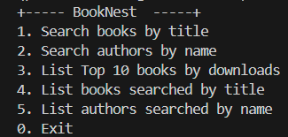

# BookNest  

BookNest is a backend project built with **Java** and **Spring Boot**, designed to create a book catalog by consuming an external API, storing data in a relational database, and providing interactive options for users to explore books and authors.
---

## Features  

- **API Integration**: Fetch book data from an external API.  
- **Data Storage**: Persist fetched data in a relational database.  
- **User Interaction**: Provide at least 5 options to filter, search, and display book and author details.  
- **JSON Parsing**: Process and analyze JSON responses from the API

## Screenshot
Menu

## Technical Details

* Java 21
* Spring Boot 3.4.0
* PostgreSQL 17

## Installation and Execution

1. Clone the repository
2. Install dependencies using Maven
3. Configure the database connection by properties
4. Run the application using `./mvnw spring-boot:run` 

## Contributions and Collaboration

* Fork the repository and submit a pull request